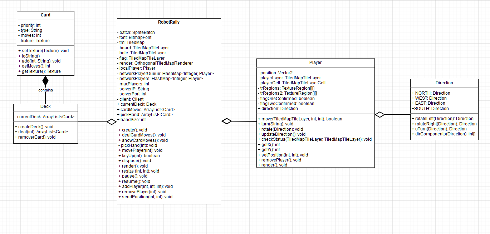

#### NB! Readme er nå separert fra svar på oppgavene og inneholder nå kun viktig informasjon om programmet.
#### Noen av spørsmålene kan ligge i readme hvis det egner seg.

## Deloppgave 1: Prosjekt og prosjektstruktur
- Rollene i teamet har så langt fungert veldig bra.
  Tildeling av rollene har ikke ført til noen problemer innad i teamet enda. 
  Vi har ikke noe behov for å bytte på noe roller, teamlead og kundekontakt har gjort en særdeles god jobb.
  
- Så langt i prosjektet er det kun teamlead rollen som har skilt seg ut fra de andre rollene.
  Teamleaderen styrer hva vi skal diskutere i møtet og er knutepunktet av kommunikasjon mellom alle medlemmene.
  Alle andre rollene føler vi ikke har så stor betydning enda siden vi er så tidlig i prosessen.
  
- Vi har bestemt oss for å prøve en litt annerledes prosjektmetodikk enn vi har brukt tidligere. 
  Vi skal prøve “sprint” metoden, siden vi har mye å gjøre på kort tid.
  
- Så langt er gruppedynamikken ganske bra. Vi har ikke møtt så mye motstand så langt i prosjektet, 
  så det har hjulpet med at det har vært god stemning i gruppen.
  
- Kommunikasjonen i teamet er ganske bra og vi kommer godt overens. 
  Det hjelper veldig at vi har et ukentlig møte som alle må komme på slik at vi kan planlegge flere møter fremover. 
  Store deler av kommunikasjonen skjer på møtene.
  
- Snakke sammen før vi begynner å jobbe, flinkere med å sette opp trello kort, 
  planlegge arbeidsoppgavene på en slik måte at ingen må vente på at en annen del av koden er ferdig før de kan begynne på sin oppgave. 
  Vi kan også bli flinkere til å skrive møtereferat. Så langt har vi jobbet ganske tett og fått gjort kravene som vi har fått tildelt. 
  Vi har fått til møter utenom de ukentlige gruppetimene og har god oppmøte på disse.
  
- Vi har i stor grad parprogrammert på mye av oppgaven derfor er det ugjevnt med commits på github. 
  I Trello boardet står det hvem som har vært med på hva.
  
- Vi har vedlagt møtereferat lenger nede i dokumentet.

1. Vi bør bli flinkere å skrive effektive og mer utfyllende møtereferat fortløpende etter hvert møte slik at vi har en god oversikt over hvor vi ligger i prosessen.
2. Vi bør bli flinkere med å sette opp trello kort, 
   dette vil være til stor hjelp når vi skal jobbe mer individuelt for å se hvem som gjør/har gjort hva og hva som bør gjøres.
3. Bedre på å planlegge arbeidsoppgavene på en slik måte at ingen må vente på at en annen del av koden er ferdig før de kan begynne på sin oppgave

### Prosjektmetodikk: Kanban
Kanban er en prosjektmetodikk som har veldig lite regler. 
Dette er en av hovedgrunnene til at vi har valgt den fordi da føler vi at vi kan jobbe litt sånn som vi ønsker. 
Dette føler vi at egner seg mye bedre i et lite team på 5 medlemmer. Sentralt for Kanban er en prosjekt tavle. 
Vi bruker Trello, sånn at vi kan se hvem som gjør hva til ethvert tidspunkt og hva som skal bli gjort. 
En ulempe med Kanban er at det begrenser parallelt arbeid, det betyr at vi ikke kan gjøre mange oppgaver samtidig. 
Dette tror ikke vi kommer til å bli noe problem siden MVP kravene ser ut som at de må bli gjort i den rekkefølgen de er satt opp i og vi har tenkt å jobbe mye sammen.
Med Kanban dreier det seg om å gjøre ferdig oppgaver fullt og helt før man fortsetter videre på noe annet. 
Det vil alltid være oppgaver i prosjekt tavlen og vi skal avgjøre på møter hvilke oppgaver som skal bli gjort først og hvilke som vi er nødt til å vente med.

### Retrospektiv for prosjektmetodikk:
Stort sett har vi jobbet en del sammen og avtalt hva som skal bli gjort. 
Vi valgte å bruke Kanban som prosjektmetodikk fordi den gir rom for å potensielt lage sine egne regler. 
Kanban har veldig lite regler, noe som vi liker siden da har vi fått jobbet som vi vil.
Vi har brukt Trello til god effekt så langt i prosjektet, men vi kan bli litt bedre på å oppdatere tavlen fortløpende. 
En ulempe med Kanban er at det ikke egner seg så godt for parallelt arbeid, 
så langt har vi ikke opplevd dette annet enn med at vi måtte vente på at multiplayer ble fullført før vi kunne fortsette på MVP krav. 
Vi har jobbet mye sammen, så det at Kanban begrenser parallelt arbeid har ikke vært et merkverdig problem så langt. 
Vi har valgt å blande inn mye parprogrammering i vår prosjektmetodikk siden vi føler da får alle en god og lik tanke om hvordan vi skal gå fram på å løse problemer vi støter på.

## Deloppgave 2: Krav

Vi har lagd brukerhistorier i filen Brukerhistorier: [Brukerhistorier](Brukerhistorier.md)

- Vi har i hovedsak prioritert å fullføre MVP. Vi har laget noen akseptansekriterier som går litt forbi MVP så vi har ikke rukket å bli ferdig med disse. 
For eksempel er ikke implementasjon av turer/runder er ikke en del av MVP så kriterien “disse kortene skal beholdes resten av runden” har ikke blitt fullført. 
Det er også noen kriterier som vi føler ikke er så viktig å få gjort enda. Som for eksempel kriterien ‘“Continue?” screen’.
- Vi har fortsatt prioritert oppgavene i rekkefølgen av MVP.
- Vi har ikke gjort noen endringer på MVP. Vi har ikke fått produktet til å se ut som vi har lyst, for eksempel velger man kort gjennom konsoll istedenfor GUI. 
  Dette er noe vi skal få gjort, men prioriterte ikke dette siden det ikke står noe spesifikt om det i MVP.
- Vi har fullført MVP i den prioriterte rekkefølgen som de ble utgitt til oss. Vi har fortsatt litt vi har lyst å få implementert, som GUI for kort og server. 
  Dette har vi nedprioritert siden det ikke står spesifikt i MVP at dette er noe vi må ha.
- Vi har skrevet i README.md filen om “known bugs” og “possible solutions”. Så vi refererer til den seksjonen for bugs.

## Deloppgave 3: Kode

- Vi har skrevet i [README.md](../README.md) filen hvordan programmet bygges og kjøres så vi refererer til den seksjonen for bygging og kjøring av programmet.
- Vi hadde problemer med automatiske tester for Libgdx og måtte se oss nødt til å fjerne disse derfor er det inntil videre kun manuelle tester.
- Vi har Junit tester på for eksempel oppsett av server og kryonet.
- Vi har laget klassediagram for de viktigste klassene i programmet, dette ligger som en drawio fil som du finner i Deliverables: [klassediagram.drawio](klassediagramOblig2.drawio)
  
- Vi har dessverre måtte kun skrive manuelle tester for bevegelse av robot og diverse spill funksjoner. 
Dette er fordi vi har hatt problemer med JUnit tester ikke får tilgang til textures og dermed mislykkes testene. Vi prøvde å få hjelp med dette problemet fra gruppeleder men kom dessverre ikke til noe løsning. Fikk beskjed om å bare skrive manuelle tester inntil videre. Vi håper å få ordnet opp i dette problemet og få til skikkelige automatiske tester. 

