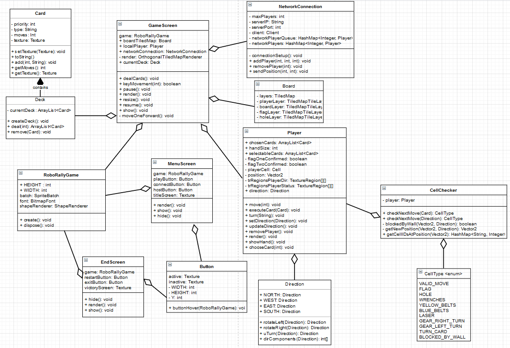

## Deloppgave 1: Team og prosjekt
- Møtereferat ligger i egen fil i Deliverables
- Vi har erfart at rollene i teamet har veldig lite å si. 
  Kundekontakt fant vi fort ut at var en ganske ubetydelig rolle og skapte mer stress enn nødvendig. 
  Det som har fungert så langt er at vi har diskutert problemer sammen hvor gruppeleder tar spørsmål videre. 
  Andre små spørsmål som er individuelt for ens oppgave har ofte blitt tatt videre av den enkelte personen dette gjelder. 
  Ellers synes vi at team leader gjør en suveren jobb og vi føler vi har valgt rett person til jobben.
- Siden vi har valgt Kanban som prosjektmetodikk og den begrenser parallelt arbeid så har vi merket det skikkelig på denne innleveringen. 
  Vi bestemte oss for å prioritere å lage en meny til å navigere inn i spillet med først. Dette viste seg å være mer arbeid enn vi forventet. 
  Dermed ble mye av funksjonaliteten til spillet satt på vent siden vi måtte gjøre om mye av koden for å klare å implementere flere “skjermer”. 
  Vi har også hatt litt problemer med å samle folk til møter denne gangen og det har hatt mye med at folk har hatt annet arbeid å gjøre også. 
  Nå har vi prøvd å rydde opp i prosjektet vårt slik at det blir lettere å implementere funksjonalitet i framtiden og flere kan jobbe med ulik funksjonalitet for spillet samtidig. 
  Dette gjør også at det ikke er alt for mye ny funksjonalitet, fordi da måtte dette blitt skrevet helt om med en gang vi hadde ryddet opp koden og hadde vært unødvendig bruk av tid.
- Forrige innlevering nevnte vi at vi bør bli flinkere med å snakke sammen før vi begynner å jobber og bli flinkere til å sette opp trello kort. 
  Dette føler vi at vi har blitt bedre på, men kan jo selvfølgelig alltid bli flinkere. 
  Vi har blitt bedre på å lage oversiktlige Trello kort, dette var et av punktene vi ville forbedre på forrige leveranse. 
  Vi nevnte også at vi burde bli flinkere på å planlegge arbeidsoppgavene på en slik måte at ingen må vente på at en annen del av koden er ferdig før de kan begynne på sin oppgave. 
  Dette var et ganske stort problem på denne leveransen og vi har prøvd å gjøre programmet mer effektivt slik at dette ikke blir et problem i fremtiden. 
  Vi kan alle (utenom teamlead) bli litt flinkere med git. 
  Sånn som det er nå er det nesten kun teamlead som merger og lager pull requests og dette kan bli et problem hvis teamlead ikke er tilgjengelig. 
  Vi må bli flinkere til å begynne med planlegging tidligere. Leveranse er vanligvis på fredager så vi bør begynne å planlegge fortløpende etter det, 
  slik at alle kan begynne på sine oppgaver tidlig. 
  Vi har vanligvis ventet til vi har fått ut neste oppgave, men det har ikke fungert så veldig bra.
- Tre punkter vi tenker vi kan forbedre oss på er:
    1. Siden vi ikke fikk dette til fra forrige leveranse tar vi det med igjen:
       Vi bør bli bedre på å planlegge arbeidsoppgavene på en slik måte at ingen må vente på at en annen del av koden er ferdig før de kan begynne på sin oppgave
    2. Starte planleggingen tidligere
    3. Bli flinkere med Git, samt fikse mer av codacy feilene i git. 
- Oppgavene fremover blir alltid laget i git og ferdigstilt før vi setter de i TODO fanen. 
  Fremover skal vi ha fokus på funksjonalitet ettersom denne innleveringen gikk mye på å refaktorere kode. 
- Link til trello: https://trello.com/b/D3Y3MkLV/roborally
- Skjermbilde lagt ved er fra 26.03. Anbefales å sjekke linken over for å få nyeste utgave.

- Gruppedynamikken er stort sett utrolig bra. Vi passer på at det er rom for humor og pauser som ikke alltid handler om kode. 
  Dette skaper god stemning i gruppen og hjelper til med å holde motivasjonen oppe.
- Gruppen kommuniserer godt over discord, hvor vi avtaler møter, diskuterer problemer og eller snakker om funksjonalitet.
- Når en på teamet har mer kunnskap på et område prøver personen å lære gruppen det slik at alle til slutt får en god grunnleggende
  kunnskap på forskjellige områder.
## Deloppgave 2: Krav
- Vi har laget nye krav og skrevet brukerhistorier, akseptansekriterier og arbeidsoppgaver til dem i [Brukerhistorier.md](Brukerhistorier.md)
  - Vi har fullført noen av disse kravene til denne leveringen men noen av kravene var litt større enn vi hadde forventet og blir dermed mål for neste innlevering.
  - Vi har kommet forbi MVP og fremover har vi tenkt å prioritere faser og runder og legge til mer funksjonalitet som liv og GUI for kort.
- Bugs som finnes er lagt i [README.md](../README.md) under known bugs.

## Deloppgave 3: Produktleveranse og kodekvalitet 
- Bygging og kjøring for kode ligger i [README.md](../README.md)
- Klassediagram ligger i Deliverables som [klassediagram.drawio](klassediagram.drawio)

- Vi har dessverre måtte nesten kun ha manuelle tester, fordi som forrige gang, 
  har vi hatt store problemer med at vi får NullPointerException på Textures når vi prøver å loade feks. 
  Button, Player, Card i test klassen. Vi har prøvd å ordne dette, 
  men endte opp med å bruke mer tid på det enn nødvendig. Så vi har bestemt oss for å skrive manuelle tester.
- Vi har i stor grad parprogrammert på mye av oppgaven derfor er det ugjevnt med commits på github. 
  I Trello boardet står det hvem som har vært med på hva. 
  Vi har prøvd å ha litt forskjellige folk som committer denne gangen når vi har parprogrammert. Det er også fler som har laget pull requests denne gangen.
- Link til trello: https://trello.com/b/D3Y3MkLV/roborally

