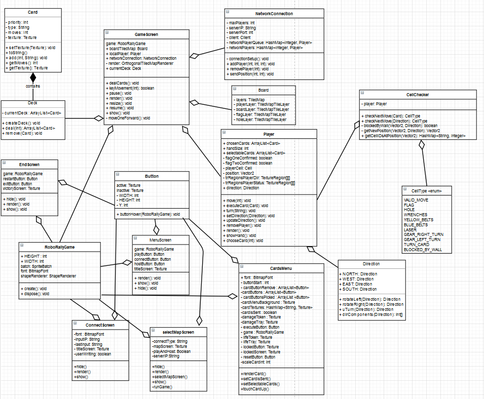

## Deloppgave 1: Team og prosjekt
Møtereferat ligger i egen fil i Deliverables
Rollene i teamet har ikke endret seg noe særlig. 
Teamleaden (Thomas) er fremdeles samme og denne gangen følte vi at kodeansvarlig (Kristian) var en viktig rolle, 
siden de tok tak og fikset mye rot i koden som gjorde det lettere å jobbe parallelt. 
Vi har også fått en slags grafisk designer (Sondre) rolle, siden de har laget egne grafikk til skjermer, 
knapper og unike spiller sprites. Vi har også hatt en person som har hatt ansvar for multiplayer hele veien, 
så de har vel hatt en slags server ansvarlig rolle (Simen). 
Ellers er alle med å utvikle. Alle gikk inn i prosjektet med noe som de kunne bedre enn andre, 
men vi har likevel sørget for at alle har fått nok av utfordringer.

Denne leveransen har vi jobbet litt annerledes, vi har gitt alle hvert sitt ansvar og alle har fått gjort dette samtidig. 
Så nå har vi fått gjort litt flere oppgaver parallelt. 
Vi har vel strengt tatt fortsatt Kanban som vår prosjektmetodikk siden vi bruker fremdeles aktivt prosjekttavle, 
men vi har få til det til denne gangen at vi kan jobbe på flere oppgaver samtidig, noe som var et lite problem på forrige leveranse. 
Vi valgte å fokusere mer på å rydde opp i koden vår på forrige leveranse og det er vi veldig glad for at vi gjorde, 
fordi det har gjort det mye lettere for oss å implementere nye ting.
Vi synes prosjektet har gått ganske greit. Vi føler vi har fått gjort en god del på selve leveransen som er over MVP. 
Vi har også blitt bedre med denne leveransen med å planlegge arbeidsoppgavene på en slik måte at ingen må vente på at en annen del av koden er ferdig før de kan begynne på sin oppgave. 
Vi planla alt litt tidligere slik at vi kunne få gjort litt mer kodemessig og vi har alle blitt litt flinkere på git og github.
Alle har nå en grei forståelse av branches, pull-requests og merge.
På større pull-requests har vi sørget for å ha en ganske god beskrivelse med bilder og chekclister.
På mindre pull-requests så har vi valgt å holde det til noen beskrivende setninger.
Dette var de tre punktene vi sa ved forrige leveranse at vi skulle bli flinkere med og det føler vi at vi har fått gjort. 

I helheten av prosjektet føler vi at vi har vært ganske flink med å planlegge hva vi har lyst til å gjøre sammen, 
slik at alle henger med hvordan produktet ser og skal se ut. 
Noe vi kunne gjort bedre er å ha startet med en god kodestil slik at vi ikke måtte bruke store deler av tiden på å refaktorere koden, 
dette skjer gjerne når det er mange som jobber på noe samtidig.
https://trello.com/b/D3Y3MkLV/roborally
- Under ser du bilde av Trello-tavlen vår, den er nå ganske blank nå ettersom vi har lagt til fortløpende.

I starten var det gjerne litt stille i voice channelen på discord men nå er det ikke like stille lengre. 
Vi snakker og planlegger godt sammen og stiller hverandre spørsmål om det er noe vi lurer på om noe noen har gjort. 
Vi lagde en egen chat på discord og det har hjulpet mye med å få raske svar fra alle siden det er ikke alle som sjekker INF112 discorden så ofte. 
I helheten av prosjektet har kommunikasjonene og gruppedynamikken vært veldig bra og bare blitt bedre over tid, vi har ikke blitt uvenner enda.

## Deloppgave 2: Krav
Vi har lagt til noen nye krav som ligger i brukerhistorier.md i deliverables.
Vi har laget nye krav og skrevet brukerhistorier, akseptansekriterier og arbeidsoppgaver til dem i Brukerhistorier.md.
Bugs som finnes er lagt i [README.md](../README.md) under known bugs.
Vi rakk ikke å fullføre det siste kravet med å ha spiller kollisjon. Dette ble ikke så høyt prioritert.

## Deloppgave 3: Produktleveranse og kodekvalitet
Bygging og kjøring for kode ligger i [README.md](../README.md)
Eventuelle bugs ligger også i readme, dette gjelder også bugs som kan påvirke tester.
- Klassediagram ligger i Deliverables som [klassediagram.drawio](klassediagram.drawio)

Vi har dessverre måtte nesten kun ha manuelle tester, fordi som forrige gang, 
har vi hatt store problemer med at vi får NullPointerException på Textures når vi prøver å loade feks. 
Button, Player, Card i test klassen. Vi har prøvd å ordne dette, men endte opp med å bruke mer tid på det enn nødvendig. 
Så vi har bestemt oss for å skrive manuelle tester. For å teste programmet må man kjøre det i debug mode, 
da kan man bevege spiller med piltaster.
Vi har i stor grad parprogrammert på mye av oppgaven derfor er det ugjevnt med commits på github. 
I Trello boardet står det hvem som har vært med på hva. 
Vi har prøvd å ha litt forskjellige folk som committer denne gangen når vi har parprogrammert. 
Det er også fler som har laget pull requests denne gangen.
Link til trello: https://trello.com/b/D3Y3MkLV/roborally
 
